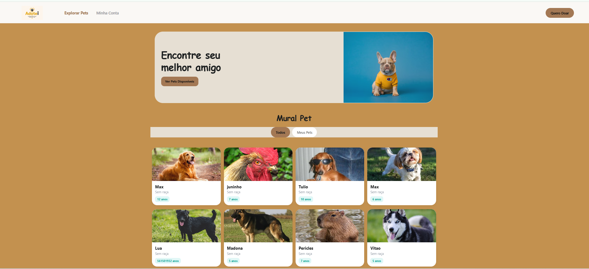

# Adotei — Pet Adopt App

O **Adotei** é um aplicativo mobile desenvolvido em React Native projetado para conectar animais em busca de um lar a potenciais adotantes. O projeto simula a rotina de desenvolvimento de uma equipe de software real, integrando conceitos avançados de interface, gerenciamento de estado global, consumo de APIs e persistência de dados.

---

## Demonstração do Aplicativo

Para dar destaque visual ao projeto e demonstrar a fidelidade do nosso Design System baseado em tons terrosos e cartões flutuantes responsivos, veja abaixo uma prévia das principais telas do ecossistema:

<p align="center">
  
</p>

> *Dica técnica para a banca: O layout foi projetado utilizando o hook `useWindowDimensions` do React Native, permitindo que a interface se adapte dinamicamente de colunas duplas em smartphones para uma estrutura de grid expandido (até 4 colunas) quando visualizado em telas desktop.*

---

##  Organização da Equipe e Metodologia

Para o desenvolvimento deste projeto, a equipe adotou a prática de **Pair Programming (Desenvolvimento em Par)** durante os encontros presenciais em sala de aula. Toda a estrutura arquitetural, tomadas de decisão de design, lógica de negócios e integrações com o servidor foram discutidas e implementadas de forma colaborativa a quatro mãos. 

* **Desenvolvimento e Integração:** Isaías de Oliveira & Equipe.
* **Gestão de Repositório:** Devido ao formato de desenvolvimento pareado em um único ambiente físico, os envios e o histórico de entrega foram centralizados no perfil principal, refletindo o esforço conjunto do grupo nas sessões de codificação.

---

##  Resumo Estrutural e Arquitetura

O projeto foi estruturado seguindo o padrão de separação de responsabilidades em camadas, garantindo modularidade e reatividade em tempo real:

1. **Camada de Autenticação e Sessão:** Centralizada no `UserContext`. Controla o estado de login e cadastro de novos protetores. Se o estado do usuário for nulo (`user === null`), o sistema bloqueia as rotas privadas e força o redirecionamento para o fluxo de segurança.
2. **Gerenciamento de Estado Global (Context API):** Centralizado no `PetContext`. Funciona como o coração de dados do app, gerenciando os arrays trazidos do servidor, estados booleanos de carregamento (`loading`) e injetando as funções de manipulação nas telas dependentes.
3. **Camada de Serviços (Services):** Isolamento de requisições assíncronas na pasta `services/petService.js`, utilizando requisições HTTP para realizar operações de busca de pets por ID, listagem geral, atualizações e deleções físicas diretamente no banco de dados da API.

---

##  Estrutura de Branches

Para simular o ambiente de entrega real, o escopo técnico do projeto foi idealizado e dividido nos seguintes módulos de funcionalidades:
* `feature/auth` — Telas de Login, Cadastro e segurança de rotas.
* `feature/services` — Configuração da camada de dados e isolamento das requisições HTTP.
* `feature/home` — Renderização do mural de pets, componentes de cartões dinâmicos e filtros de categoria.
* `feature/details-favorites` — Telas de detalhes avançados, fluxo de contato direto via WhatsApp (Linking) e lógica interna de favoritar/gerenciar pets.

---

##  Como Executar o Projeto Localmente

Certifique-se de ter o ambiente Node.js instalado em sua máquina. Para rodar o aplicativo e iniciar o Metro Bundler do Expo, siga o passo a passo abaixo:

1. **Clone o repositório para sua máquina local:**
   ```bash
   git clone <link-do-seu-repositorio>
   ```
2. **Entre na pasta do projeto e instale as dependências do Node:**
    ```bash
   npm install
   ```
3. **Inicie o servidor de compilação limpando o cache temporário:**
    ```bash
   npx expo start -c
   ```
4. **Visualização:** Abra o emulador Android/iOS instalado no seu computador, ou clique para abrir o link do localhost ou escaneie o QR Code gerado no terminal usando o aplicativo Expo Go no seu celular físico.
